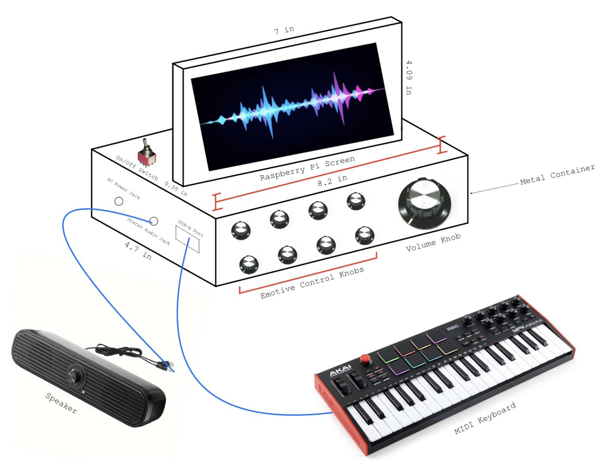
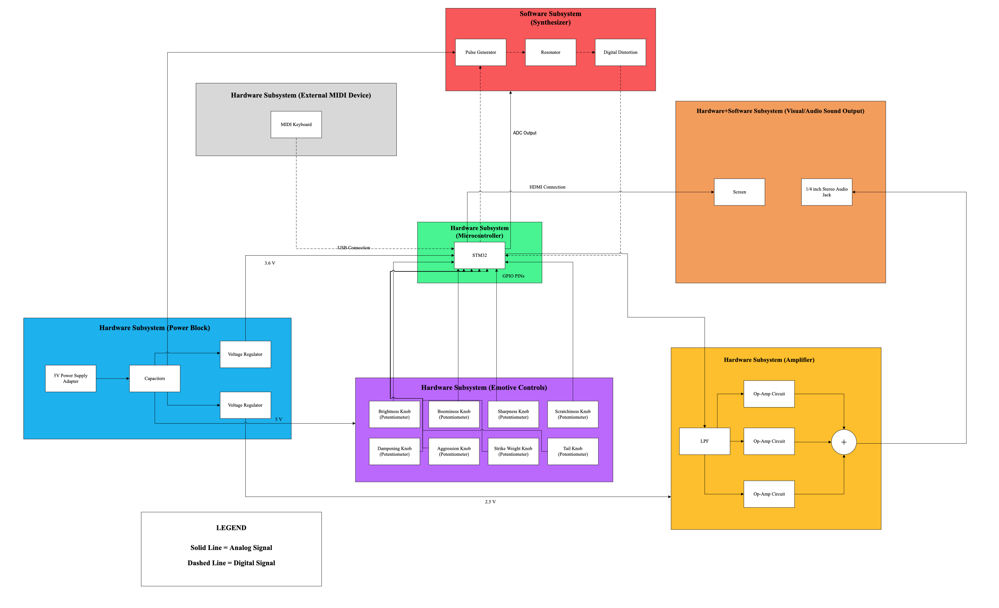
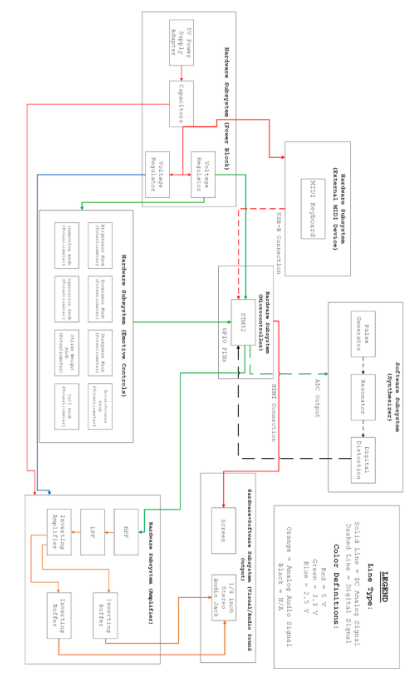
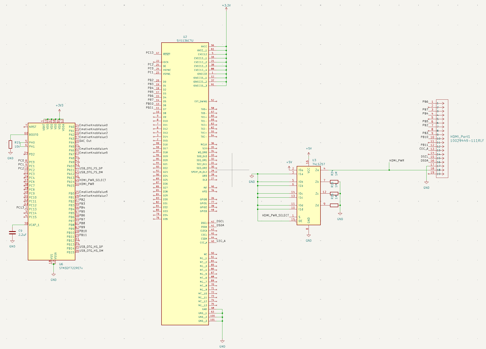
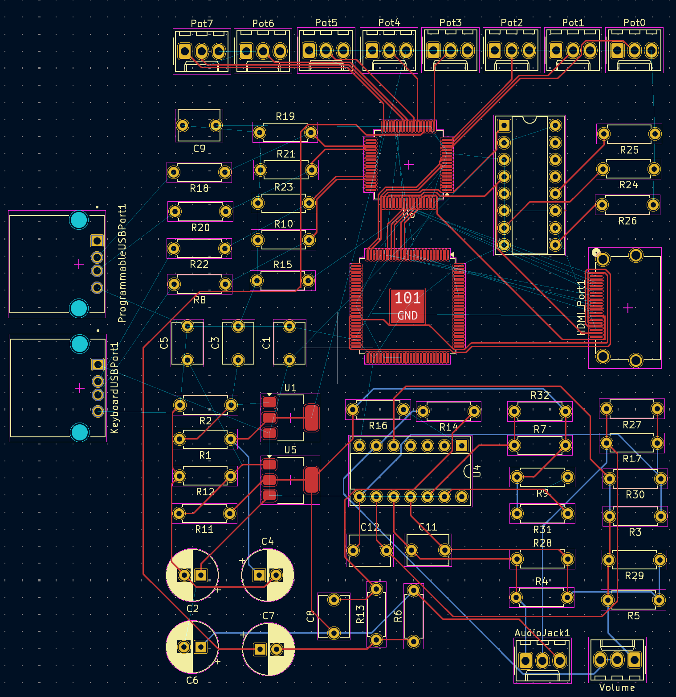

# Abhi's Weekly Worklog

Dates:
- Week 1: 10/07/2024-10/11/2024
- Week 2: 10/14/2024-10/18/2024
- Week 3: 10/21/2024-10/25/2024
- Week 4: 10/28/2024-11/01/2024
- Week 5: 11/04/2024-11/08/2024
- Week 6: 11/11/2024-11/15/2024
- Week 7: 11/18/2024-11/22/2024
- Week 8: 11/25/2024-11/29/2024
- Week 9: 12/02/2024-12/06/2024
- Week 10: 12/09/2024-12/13/2024

# Week 1: 10/07/2024-10/11/2024

The objectives and responsibilities for the week were initially set in the Design Document as follows...

1. Order Parts (Everyone)
2. Prepare for the Design Review Meeting (Everyone)
3. Develop PCB Schematic (Everyone)

TA Meeting Notes:

During the TA meeting for this week, Manvi gave us some feedback on our initial Project Proposal document
and let us know that we needed to fix up our visual aid, add more details to the tolerance analysis,
and add additional ethical and safety concerns for the Design Document.

Record of what was accomplished:

In terms of our accomplishments for the week, we were able to meet to finalize our Design Document and prepare
for the Design Review session. Overall, I thought it went pretty well as we were able to effectively communicate
the different components of our block diagram and thoroughly explain our tolerance analysis for the Amplifier subsystem.
Unfortunately, we were unable to place the order for our parts this week, however we got much closer to finalizing our entire parts list.
Since we were still deciding on parts, we didn't move on to developing the PCB schematic either.

Partner Summary:

N/A (Worked on everything together this week)

# Week 2: 10/14/2024-10/18/2024

The objectives and responsibilities for the week were initially set in the Design Document as follows...

1. Implement modified Karplus-Strong Algorithm in C/C++ (Joel)
2. Research how to display data from STM32 via HDMI (Abhi)

TA Meeting Notes:

During the TA meeting for this week, Manvi mainly gave us some feedback on our Design Document and let us know that we needed to fix up our 
block diagram to make it less colorful and include voltages and arrow labels, and add one more ethical concern for the Design Document. 
From her feedback from the previous week, I redrew our visual aid with more specifically labeled components and dimensions as shown below.

Record of what was accomplished:

In terms of our accomplishments for the week, we were able to finalize our components list and I placed the orders for our group as shown in the image below. We also both
worked on the Teamwork Evaluation Form to provide some early feedback on our team dynamic.

Partner Summary:

- Added additional detail to the tolerance analysis from a hardware perspective
- Started building the subsystem schematics on KiCAD

# Week 3: 10/21/2024-10/25/2024

The objectives and responsibilities for the week were initially set in the Design Document as follows...

1. Solder components to PCB (Joel)
2. Configure PCB Enclosure with necessary openings (Abhi)

TA Meeting Notes:

During the TA meeting for this week, Manvi gave us some feedback on our subsystem circuit design, mostly telling us that it looked good and we needed to start prioritizing
getting our PCB design done. From her feedback from the previous week, I redrew our block diagram to be less colorful and be more thoroughly labeled.

Initial Block Diagram:

Updated Block Diagram:

Record of what was accomplished:

In terms of our accomplishments for the week, I fixed the errors in our circuit schematic, specifically in the Screen subsystem. I had initially read the datasheet incorrectly,
so I needed to reconfigure some of the pins, such as the HSYNC, VSYNC, HPD, as well as some of the TMDS signal inputs to the HDMI port.

Shown below is our updated Screen Subsystem Schematic:

Partner Summary:

- After I fixed the circuit schematic for the Screen subsystem, Joel started fixing the traces for it within the actual PCB design.

# Week 4: 10/28/2024-11/01/2024

The objectives and responsibilities for the week were initially set in the Design Document as follows...

1. Individually test Hardware Subsystems to check if R&V is met (Joel)
2. Individually test Software Subsystems to check if R&V is met (Abhi)

TA Meeting Notes:

During the TA meeting for this week, Manvi mostly just helped us debug some of the issues with our PCB design.

Record of what was accomplished:

In terms of our accomplishments for the week, Joel and I finalized our PCB design.

Shown below is our finalized PCB design:

Partner Summary:

- After we finished up our PCB design, Joel sent the files over to Manvi to place our PCB order.

# Week 5: 11/04/2024-11/08/2024

The objectives and responsibilities for the week were initially set in the Design Document as follows...

1. Integrate hardware and software subsystems (Everyone)

TA Meeting Notes:

During the TA meeting for this week, Manvi gave us some feedback on our Design Document, mainly saying that we needed to fix
our block diagram by making it more compact and increasing the font-size within the blocks.

Record of what was accomplished:

In terms of my accomplishments for the week, I fixed the block diagram according to Manvi's comments and also, completed my individual progress
report that highlighted my progress with the Screen subsystem at the circuit level and my plans for the software integration in the coming weeks.

Shown below is our finalized PCB design:

Partner Summary:

- During this week, Joel worked on building a physical circuit for the Amplifier subsystem to verify that the circuit that was drawn in KiCAD was
functional in practice.

# Week 6: 11/04/2024-11/08/2024

The objectives and responsibilities for the week were initially set in the Design Document as follows...

1. Debugging (Everyone)

TA Meeting Notes:

During the TA meeting for this week, I went over some of my progress with Manvi. I showed her some of the test scripts I had written for the Microprocessor and
explained to her that I'm still reading through the relevant STM32 documentation about programming the Microprocessor and flashing firmware to it.

Record of what was accomplished:

In terms of my accomplishments for the week, I started writing a script to write "Hello World!" on the Microprocessor using C to prove that the Microprocessor could perform
computations. However, after writing some skeleton code, I decided to instead prove that it was working from a visual perspective and so, I instead wrote code to write to a GPIO pin on the processor, which
I would connect directly to an LED and if the LED lit up after the program ran, this would verify that the Microcontroller was functioning as expected.

Shown below is a snippet of my "Hello World!" test program:

Another accomplishment for the week was that we were able to begin testing the Microcontroller and Emotive Controls subsystems on the PCB. After soldering the Power Block subsystem and connecting it to power, the potentiometers
in the Emotive Controls subsystem were providing accurate voltage readings from the multimeter, however we realized that the Microprocessor was not receiving any power. To debug this, we went back to the PCB design on KiCAD and 
found that some of the 3.3 V trace lines weren't properly connected to the Vdd pins. To fix this issue, we attempted to connect some jumper wires to these pins, but this ended up causing our Microprocessor to overheat significantly,
so we decided to switch to using an STM32 NucleoBoard instead.

Partner Summary:

- During this week, Joel soldered all of the components from the various subsystems onto the PCB and tested the Power Block and Amplifier subsystems on the PCB to verify its functionality.
