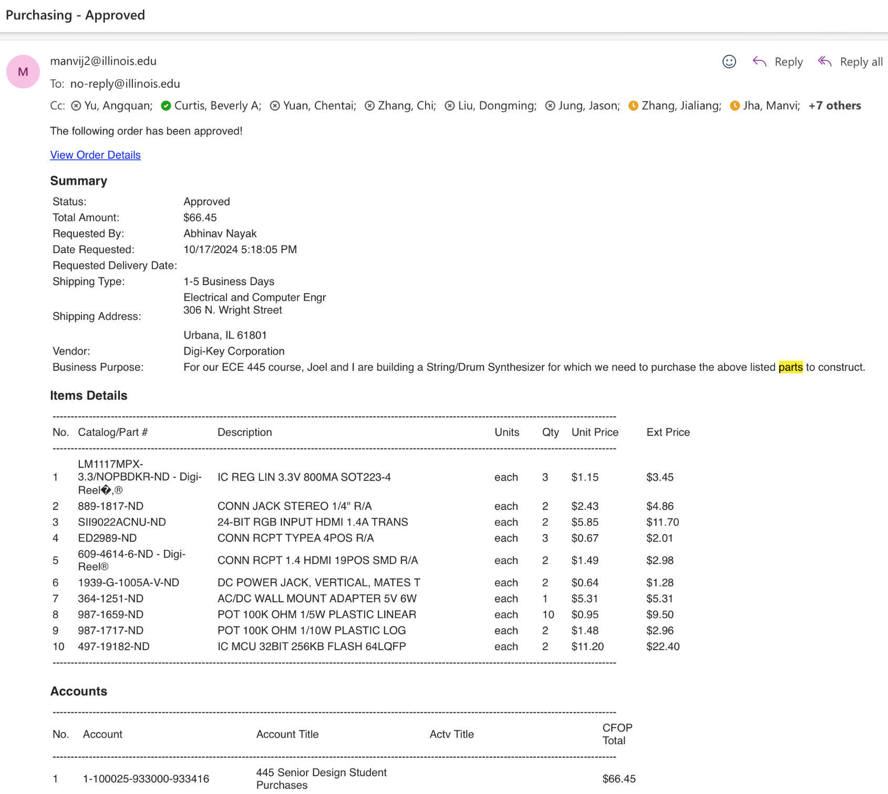
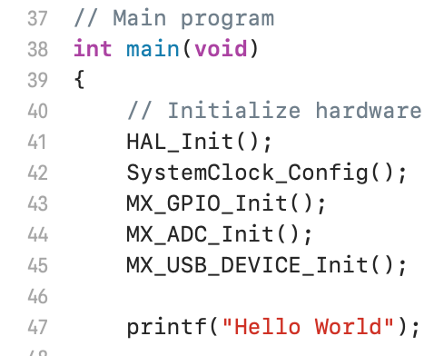

# Abhi's Weekly Worklog

Dates:
- Week 1: 10/07/2024-10/11/2024
- Week 2: 10/14/2024-10/18/2024
- Week 3: 10/21/2024-10/25/2024
- Week 4: 10/28/2024-11/01/2024
- Week 5: 11/04/2024-11/08/2024
- Week 6: 11/11/2024-11/15/2024
- Week 7: 11/18/2024-11/22/2024
- Week 8: 11/25/2024-11/29/2024
- Week 9: 12/02/2024-12/06/2024
- Week 10: 12/09/2024-12/13/2024

# Week 1: 10/07/2024-10/11/2024

The objectives and responsibilities for the week were initially set in the Design Document as follows...

1. Order Parts (Everyone)
2. Prepare for the Design Review Meeting (Everyone)
3. Develop PCB Schematic (Everyone)

TA Meeting Notes:

During the TA meeting for this week, Manvi gave us some feedback on our initial Project Proposal document
and let us know that we needed to fix up our visual aid, add more details to the tolerance analysis,
and add additional ethical and safety concerns for the Design Document.

Record of what was accomplished:

In terms of our accomplishments for the week, we were able to meet to finalize our Design Document and prepare
for the Design Review session. Overall, I thought it went pretty well as we were able to effectively communicate
the different components of our block diagram and thoroughly explain our tolerance analysis for the Amplifier subsystem. In addition to this,
we had the opportunity to attend another group's design review presentation and we filled out the Peer Design Review Google Form.
Unfortunately, we were unable to place the order for our parts this week, however we got much closer to finalizing our entire parts list.
Since we were still deciding on parts, we didn't move on to developing the PCB schematic either.

Partner Summary:

N/A (Worked on everything together this week)

# Week 2: 10/14/2024-10/18/2024

The objectives and responsibilities for the week were initially set in the Design Document as follows...

1. Implement modified Karplus-Strong Algorithm in C/C++ (Joel)
2. Research how to display data from STM32 via HDMI (Abhi)

TA Meeting Notes:

During the TA meeting for this week, Manvi mainly gave us some feedback on our Design Document and let us know that we needed to fix up our 
block diagram to make it less colorful and include voltages and arrow labels, and add one more ethical concern for the Design Document. 
From her feedback from the previous week, I redrew our visual aid with more specifically labeled components and dimensions as shown below.

Record of what was accomplished:

In terms of our accomplishments for the week, we were able to finalize our components list and I placed the orders for our group as shown in the image below. We also both
worked on the Teamwork Evaluation Form to provide some early feedback on our team dynamic.

Partner Summary:

- Added additional detail to the tolerance analysis from a hardware perspective
- Started building the subsystem schematics on KiCAD

# Week 3: 10/21/2024-10/25/2024

The objectives and responsibilities for the week were initially set in the Design Document as follows...

1. Solder components to PCB (Joel)
2. Configure PCB Enclosure with necessary openings (Abhi)

TA Meeting Notes:

During the TA meeting for this week, Manvi gave us some feedback on our subsystem circuit design, mostly telling us that it looked good and we needed to start prioritizing
getting our PCB design done. From her feedback from the previous week, I redrew our block diagram to be less colorful and be more thoroughly labeled.

Initial Block Diagram:

Updated Block Diagram:

Record of what was accomplished:

In terms of our accomplishments for the week, I fixed the errors in our circuit schematic, specifically in the Screen subsystem. I had initially read the datasheet incorrectly,
so I needed to reconfigure some of the pins, such as the HSYNC, VSYNC, HPD, as well as some of the TMDS signal inputs to the HDMI port.

Shown below is our updated Screen Subsystem Schematic:

Partner Summary:

- After I fixed the circuit schematic for the Screen subsystem, Joel started fixing the traces for it within the actual PCB design.

# Week 4: 10/28/2024-11/01/2024

The objectives and responsibilities for the week were initially set in the Design Document as follows...

1. Individually test Hardware Subsystems to check if R&V is met (Joel)
2. Individually test Software Subsystems to check if R&V is met (Abhi)

TA Meeting Notes:

During the TA meeting for this week, Manvi mostly just helped us debug some of the issues with our PCB design.

Record of what was accomplished:

In terms of our accomplishments for the week, Joel and I finalized our PCB design.

Shown below is our finalized PCB design:

Partner Summary:

- After we finished up our PCB design, Joel sent the files over to Manvi to place our PCB order.

# Week 5: 11/04/2024-11/08/2024

The objectives and responsibilities for the week were initially set in the Design Document as follows...

1. Integrate hardware and software subsystems (Everyone)

TA Meeting Notes:

During the TA meeting for this week, Manvi gave us some feedback on our Design Document, mainly saying that we needed to fix
our block diagram by making it more compact and increasing the font-size within the blocks.

Record of what was accomplished:

In terms of my accomplishments for the week, I fixed the block diagram according to Manvi's comments and also, completed my individual progress
report that highlighted my progress with the Screen subsystem at the circuit level and my plans for the software integration in the coming weeks.

Shown below is our finalized PCB design:

Partner Summary:

- During this week, Joel worked on building a physical circuit for the Amplifier subsystem to verify that the circuit that was drawn in KiCAD was
functional in practice.

# Week 6: 11/11/2024-11/15/2024

The objectives and responsibilities for the week were initially set in the Design Document as follows...

1. Debugging (Everyone)

TA Meeting Notes:

During the TA meeting for this week, I went over some of my progress with Manvi. I showed her some of the test scripts I had written for the Microprocessor and
explained to her that I'm still reading through the relevant STM32 documentation about programming the Microprocessor and flashing firmware to it.

Record of what was accomplished:

In terms of my accomplishments for the week, I started writing a script to write "Hello World!" on the Microprocessor using C to prove that the Microprocessor could perform
computations. However, after writing some skeleton code, I decided to instead prove that it was working from a visual perspective and so, I instead wrote code to write to a GPIO pin on the processor, which
I would connect directly to an LED and if the LED lit up after the program ran, this would verify that the Microcontroller was functioning as expected.

Shown below is a snippet of my "Hello World!" test program:

Another accomplishment for the week was that we were able to begin testing the Microcontroller and Emotive Controls subsystems on the PCB. After soldering the Power Block subsystem and connecting it to power, the potentiometers
in the Emotive Controls subsystem were providing accurate voltage readings from the multimeter, however we realized that the Microprocessor was not receiving any power. To debug this, we went back to the PCB design on KiCAD and 
found that some of the 3.3 V trace lines weren't properly connected to the Vdd pins. To fix this issue, we attempted to connect some jumper wires to these pins, but this ended up causing our Microprocessor to overheat significantly,
so we decided to switch to using an STM32 NucleoBoard instead.

Partner Summary:

- During this week, Joel soldered all of the components from the various subsystems onto the PCB and tested the Power Block and Amplifier subsystems on the PCB to verify its functionality.

# Week 7: 11/18/2024-11/22/2024

The objectives and responsibilities for the week were initially set in the Design Document as follows...

1. Preparing for and attending the Mock Demo (Everyone)

TA Meeting Notes:

This was one of our more important TA meetings as it was the one where we performed our Mock Demo. Unfortunately, we ran into many errors in our design and thus, we weren't able to show a fully functional product
by this point. However, we were able to show that the system could make sound and also, that the Emotive knob values could update in real-time. Also, since we were working so intensely on trying to get the Synthesizer to work, we didn't prepare much for the demo itself and so, our presentation of our project was very scattered and unorganized. Manvi's feedback for us this week was that we needed to practice a structure for how we would demonstrate our project during the final demo and also, that we needed to fix the functionality of our subsystems to have a presentable final product.

Record of what was accomplished:

In terms of my accomplishments for the week, I finished writing the script to blink an LED on and off using C to prove that our new STM32 NucleoBoard was working properly. Once I did this, we tested the code and it worked as expected, proving
that the STM32 NucleoBoard was a viable option to provide some of our system processing. I also finished up reading the STM32 documentation and figured out to configure the pins on the microcontroller to perform their required functions, write code for the processor to use,
debug the code using GDB, and lastly, generate the binary file to be uploaded to the processor to constantly perform the computations that we need. I learned that the previously listed steps would need to be completed via the STM32CubeIDE software and in order to upload the binary file, we would need to use the STM32CubeProgrammer Software. Other than this, we were able to write some code to prove that the Emotive knob values could be digitized and updated as they were being changed.

Shown below is a snippet of the preliminary code we wrote to read the Emotive knob values as they were updated:

Partner Summary:

- During this week, Joel finished building the Power Block and Amplifier subsystems. He also wrote some code to create a double buffer system for Audio output with the I2S protocol on the STM32 NucleoBoard.

# Week 8: 11/25/2024-11/29/2024

The objectives and responsibilities for the week were initially set in the Design Document as follows...

1. N/A, Fall Break (Everyone)

TA Meeting Notes:

N/A

Record of what was accomplished:

N/A (Fall Break)

Partner Summary:

- During Fall Break, Joel took some time to work on the Synthesizer algorithm in C++ and also, write some code to read the values from the Emotive Knobs on the Raspberry Pi.

# Weeks 9 & 10: 12/02/2024-12/13/2024

The objectives and responsibilities for the week were initially set in the Design Document as follows...

1. Final Demo/Presentation (Everyone)

TA Meeting Notes:

N/A

Record of what was accomplished:

In terms of our accomplishments for the week, we were able to finally build an enclosure for our Synthesizer. We did this by first heading to the FabLab on campus to be our primary workstation to complete this step. 
In the FabLab, we spent a few hours sanding down a Metal Container, drilling holes into the container for our ports and Emotive knobs, sanding down these newly made holes to ensure the enclosure would be safe to hold, and lastly,
printing out labels for each of the Emotive knobs and ports for the user to have easy accessibility to our design.

Shown below is our final physical design:

In addition to this, we worked on writing a script to convert the analog Emotive Knob values to be digital inputs to the Raspberry Pi. 

The program worked as follows (single-knob perspective) (explained in more detail in the final report):

1. Turn an emotive knob in a particular direction to toggle the voltage between 0 and 3.3 Volts.
2. Simultaneously, three select bits will be sent from the Raspberry Pi to determine which knob to read (in this case, the knob that was turned).
3. Next, it will convert the analog value of the knob into a digital one using the STM32 NucleoBoard's built-in ADC.
4. After doing this, it will take the converted value and translate it into 8 separate bits to be sent in parallel back to the Raspberry Pi to be processed within the Synthesizer Algorithm.
5. Steps 2-4 will be constantly repeated in order to provide real-time updates of the knob values.

Shown below is our final Emotive knobs code on the STM32 NucleoBoard:

Moving on, I also finalized our design document with all of the changes we had made to our system. For example, the first week I was trying to implement the Screen subsystem by first trying to visualize an arbitrary sine wave on the Raspberry Pi, however, after many attempts, I kept
getting horizontal lines that panned across the entire window that would flash quickly up and down the screen. Because we were getting so close to the final demo day, I decided it was best to move on to fixing different parts of our project instead,
such as the Emotive Controls as listed before, and thus, removed our Screen subsystem from our final Design Document.

Another highlight of the first week was that we completed our final demonstration and although we weren't able to fully complete our project, we were still able to demonstrate a semi-functional product as a whole with most subsystems working as intended. In this week, we also
attended and filled out the form for one of our peer's final demonstration that was focused on Soil Moisture readings, which was something I found very interesting as I conducted research in this field last year. Lastly, in this week, we finalized our final presentation slide deck.

Here's a link to our Extra Credit Demo Video to show our project's capabilities by this final week:
https://www.youtube.com/embed/Ir_v7jes1CY?si=TUmOt4E8HuO2rle-

This week, we completed our Final Presentation and attended one of our peer's final presentation and filled out the google form for it. I thought it was really cool to learn about how they designed and made calculations for their battery recharging system. In addition to this,
we also completed our final report and completed our Lab Checkout with Manvi.

Partner Summary:

- In the first week, Joel specifically focused on finishing the Synthesizer Subsystem on the Raspberry Pi.

# Conclusions

Although we didn't follow much of our initial weekly schedule that we created in the early stages of the Design Document, by the end of this semester, we still were able to find many successes with our project. Starting with the Power Block subsystem, we were able to produce a stable 5 Volts and 3.3 Volts for the entire system as we initially intended. Next, in the External MIDI Device subsystem, we were able to retrieve data from the keyboard upon keypress, such as the pitch of the key, with very low latency. Moving on to the Emotive Controls subsystem, we were able to both convert the analog values of the knobs into digital ones and also, send these values to the main processor within the Raspberry Pi as they were being updated in real-time. In terms of the final functionality, we were able to get our modified Karplus-Strong Algorithm working in practice as we could hear sound after each keypress and also tune the sound to our liking using the physical Emotive knobs.

