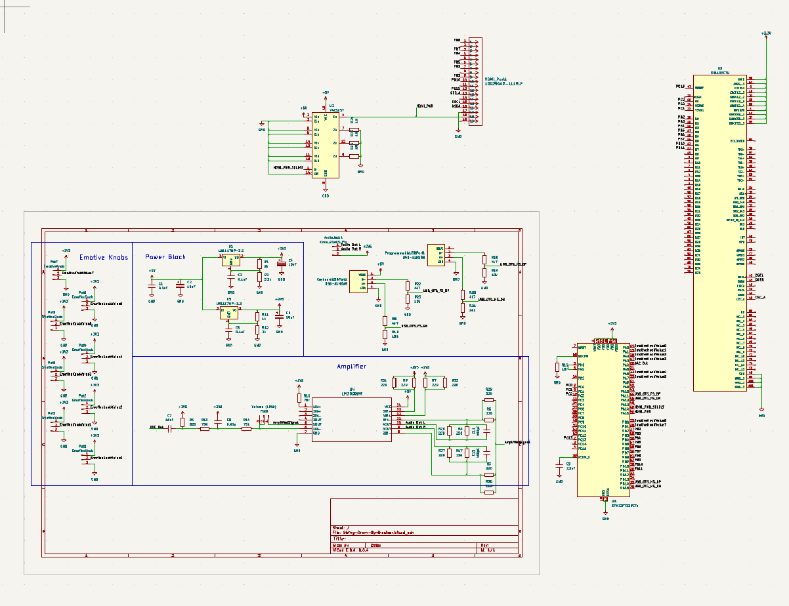
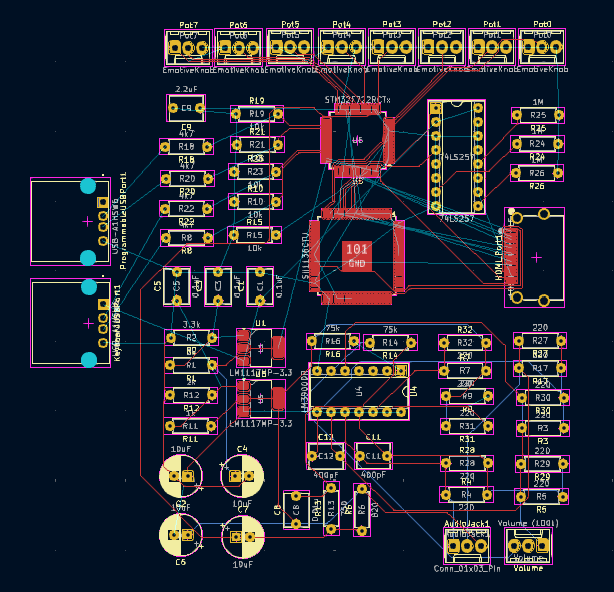
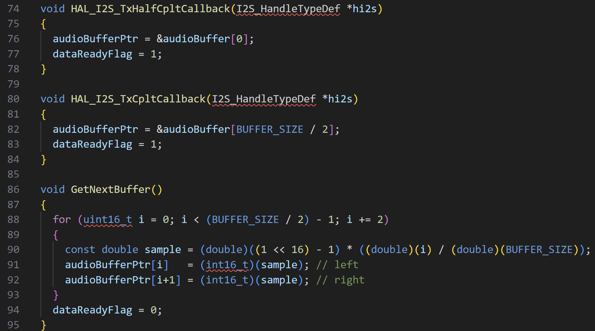
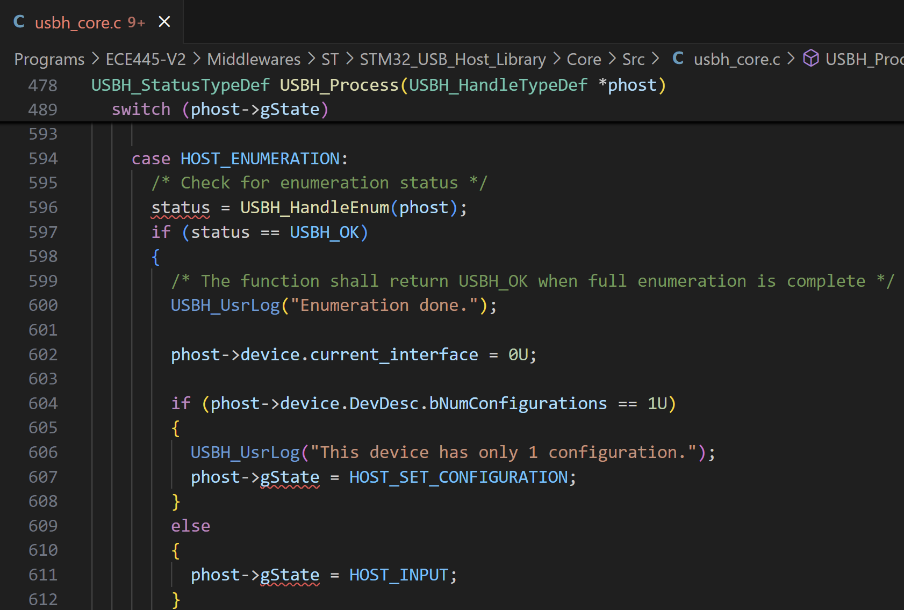
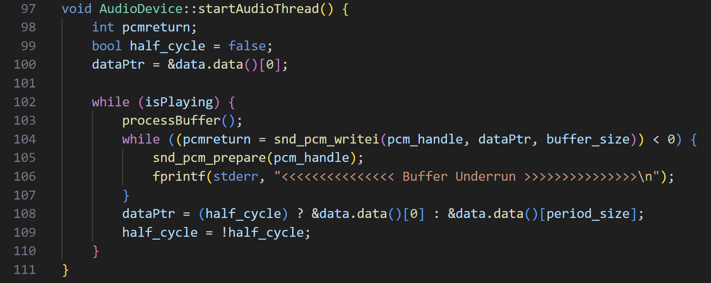
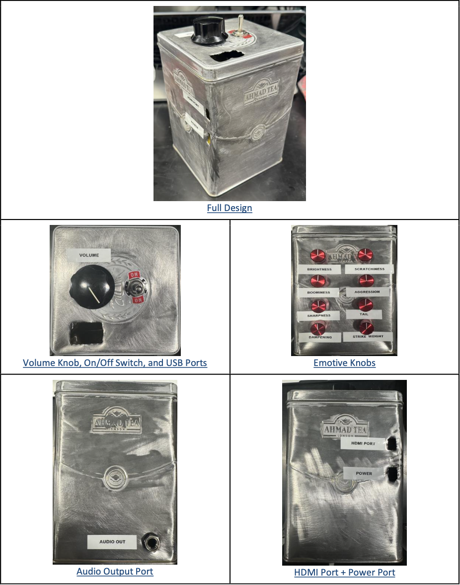
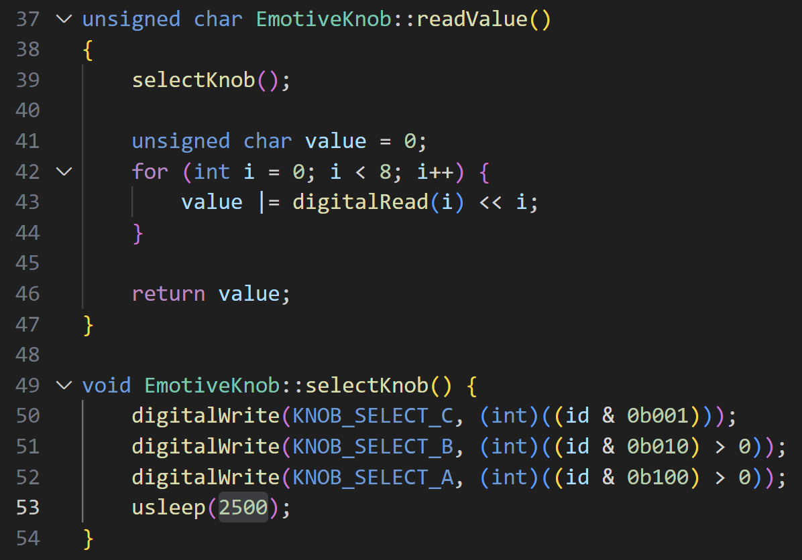
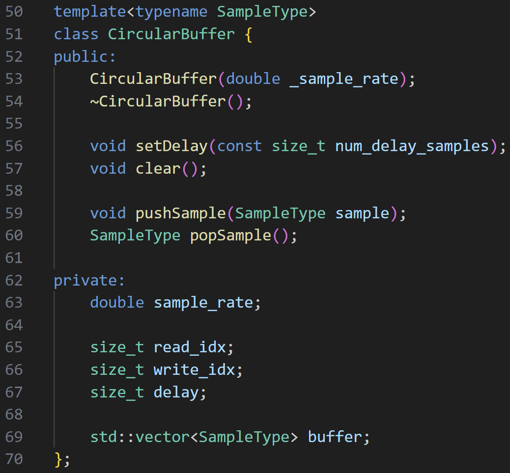
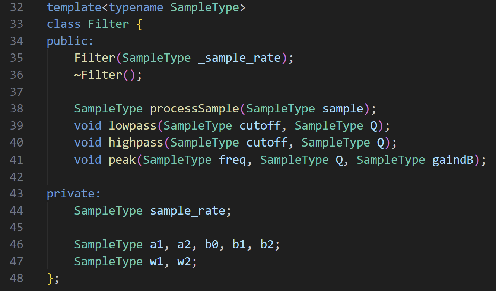

# String-Drum-Synthesizer

Dates:

- Week 1: 10/07/2024-10/11/2024
- Week 2: 10/14/2024-10/18/2024
- Week 3: 10/21/2024-10/25/2024
- Week 4: 10/28/2024-11/01/2024
- Week 5: 11/04/2024-11/08/2024
- Week 6: 11/11/2024-11/15/2024
- Week 7: 11/18/2024-11/22/2024
- Week 8: 11/25/2024-11/29/2024
- Week 9: 12/02/2024-12/06/2024
- Week 10: 12/09/2024-12/13/2024

# Week 1: 10/07/2024-10/11/2024

## This week's objectives and responsibilities:

1. Order Parts (Everyone)
2. Prepare for the Design Review Meeting (Everyone)
3. Develop PCB Schematic (Everyone)

## TA Meeting Notes:

We received feedback on our initial project proposal and Design Document critiquing our visual aid, tolerance analysis, and more ethical/safety concerns.

## Record of what was accomplished:

This week we finalized our Design Document in preparation for the Design Review session. I prepared a demo/mock up of the modified Karplus-Strong algorithm using [Reaper](https://www.reaper.fm/) (commercial software for music making). Our presentation featured explanations of the power block, amplifier subsystem, synthesizer algorithm, and tolerance analysis about transmission lines and audio. We attended another group's presentation on their pinball machine diagnosing tool. I was in charge of the schematic design and was still working out details pertaing to the amplifier and processor preventing us from ordering parts or working on the PCB.

## Partner Summary:

N/A (Worked on everything together this week)

# Week 2: 10/14/2024-10/18/2024

## This week's objectives and responsibilities:

1. Implement modified Karplus-Strong Algorithm in C/C++ (Joel)
2. Research how to display data from STM32 via HDMI (Abhi)

## TA Meeting Notes:

Manvi advised us to add another ethical concern for the Design Document and to clean up the block diagram. In addition, we discussed how to actually acheive a target output impedance. Together with Manvi, we concluded that we needed to conduct more research on the topic.

Below is the final schematic:

## Record of what was accomplished:

This week, we finalized our components list, and Abhi placed the orders. I tried to finish the PCB design but was unable to do so before the PCB review.

## Partner Summary:

- Changed Visual Aid
- Added to schematic for HDMI processing

# Week 3: 10/21/2024-10/25/2024

## This week's objectives and responsibilities:

1. Solder components to PCB (Joel)
2. Configure PCB Enclosure with necessary openings (Abhi)

## TA Meeting Notes:

We discussed our circuit design for each subsystem with Manvi. She said we needed to get our PCB design done.

Below is the final PCB layout:

## Record of what was accomplished:

I worked on the PCB design and made half of the connections before realizing the HDMI pinout was completely wrong. The datasheet was not used initially for the HDMI connections and upon looking at the schematic it was clear without even looking at the datasheet that the connections were wrong. This caused us to rectify the schematic and PCB over several days and ultimately lead to us missing the 1st round of PCB orders.

## Partner Summary:

- Fixed the circuit schematic for the Screen subsystem with me

# Week 4: 10/28/2024-11/01/2024

## This week's objectives and responsibilities:

1. Individually test Hardware Subsystems to check if R&V is met (Joel)
2. Individually test Software Subsystems to check if R&V is met (Abhi)

## TA Meeting Notes:

We debugged issues with our PCB design with Manvi.

## Record of what was accomplished:

We finalized our PCB but were too late for the 2nd round of orders, so our PCB was in the 3rd round.

## Partner Summary:

- We finished the PCB design

# Week 5: 11/04/2024-11/08/2024

## This week's objectives and responsibilities:

1. Integrate hardware and software subsystems (Everyone)

## TA Meeting Notes:

We received feedback on our Design Document about making the block diagram more compact and readable.

## Record of what was accomplished:

I soldered the amplifier circuit on perf board. There was no signal passed through from the signal generator, so I reassembled on a breadboard. The op-amp I chose created significant crossover distortion, and the solution was to choose a better op-amp.

## Partner Summary:

- Abhi changed the block diagram this week

# Week 6: 11/11/2024-11/15/2024

## This week's objectives and responsibilities:

1. Debugging (Everyone)

## TA Meeting Notes:

I discussed the problems with the amplifier circuit with Manvi.

## Record of what was accomplished:

I soldered components on the PCB only to discover our Power Block schematic had the wrong resistor values. I used voltage regulators, resistors, and capacitors to breadboard and eventually solder a working Power Block onto perf board.

## Partner Summary:

- Abhi wrote "Hello World" on the microprocessor

# Week 7: 11/18/2024-11/22/2024

## This week's objectives and responsibilities:

1. Preparing for and attending the Mock Demo (Everyone)

## TA Meeting Notes:

Our meeting was the Mock Demo this week. We could not show much as some individual parts worked but lacked integration into the rest of the project. We could show that our I2S signal was correct and therefore the double buffer system worked. However, we were not able to show that any knobs were working or able to convert the I2S signal to audio. Manvi advised us to create more structure for our actual demo as well as to focus on our high-level requirement.s

## Record of what was accomplished:

I wrote code for a double buffer system to output audio. In addition I setup to I2S system, which required 3 pins to output (Clock, Write Enable, Data). I verified that Write Enable was oscillating a 48 kHz, our sample rate.

Most of the double buffer code is in 3 functions. 2 are the full and half callbacks. These are called when the STM32 is ready for the next N samples to output. Each of the callbacks changes a pointer to a different half of the buffer to allow for the process to read samples as we write new ones. The last function is to write the samples to this buffer.

Below is the relavent double buffer code:

In addition, I tried to use an AD1856N DAC to convert the I2S signal to a PWM wave using the +/-2.5V from the power supply. The IC had no output when viewed with an oscilloscope. One attempt to rectify the problem was to try a larger power supply. In hindsight, I could have tested this with the bench power supply, but instead I spent a day remaking the power block using a 12VDC wall adapter in order to achieve +/-6V. 

## Partner Summary:

- Abhi wrote code to read a value from an emotive knob.

# Week 8: 11/25/2024-11/29/2024

## This week's objectives and responsibilities:

1. N/A, Fall Break (Everyone)

## TA Meeting Notes:

N/A

## Record of what was accomplished:

First, I soldered wires to a USB port and connected to the 5V power on the power supply (that uses a 12VDC wall adapter). When plugging in the MIDI keyboard, the voltage collapsed due to an inability to supply enough current since the keyboard requires 0.5A. I switched to the STM32 NucleoBoard's 5V pin to power which worked for the keyboard.

The USB MIDI standard calls for a device and a host. The keyboard is classified as a device, so our board must function as a host. Specifically, our board must be an "Audio Class" USB host where MIDI is a special case. All that to say I used the MIDI drivers from [this project](https://github.com/Hypnotriod/midi-box-stm32). The debugger managed to start some of the USB host protocol but kept failing to enumerate which involves a sort of handshake between device and host in order find connected devices. The debugger would reach the enumeration stage, fail, then restart the protocol.

Here is the code the debugger was stuck at:

Debugging these protocols took too much time, so I pivoted to a Raspberry Pi which provided an operating system that has USB drivers. In addition, I was able to use [RtMidi](https://www.music.mcgill.ca/~gary/rtmidi/) which provided a single callback function to handle incoming MIDI messages.

Here is the MIDI callback function:

The last issue I tackled this week was getting sound out of the Raspberry Pi. I tried to output PWM waves using the General Purpose Input Output (GPIO) pins. I was unable to view the waveform through an oscilloscope when playing a WAV file from the terminal. However, I was able to hear the file when connecting the HDMI port to a monitor and connecting headphones to the same monitor. That sparked the idea to get a cheap USB adapter in order to move on to more exhilarating problems. To finish getting sound out of the Rasbperry Pi, I programmed a double buffer by loosely following [this tutorial](https://alsamodular.sourceforge.net/alsa_programming_howto.html).

The main processing for the synthesizer will be done in the "processBuffer" function although for now it outputs a sine wave. One thing that confused me was that I am outputing 16-bit audio, but the audio buffer needed to be unsigned chars instead of shorts. However, the reason is because the most signficant byte and least significant bytes are flipped when using the ALSA library.

Here is the Rasbperry Pi double buffer code:

## Partner Summary:

- Took a break

# Weeks 9 & 10: 12/02/2024-12/13/2024

## This week's objectives and responsibilities:

1. Final Demo/Presentation (Everyone)

TA Meeting Notes:

N/A

## Record of what was accomplished:

This week, Abhi and I built the enclosure by sanding a metal tea box and drilling holes for knobs, a switch, and USB/HDMI ports for the Raspberry Pi. We printed labels for the knobs and ports.

Here is our physical design:

Next, I tried using the ADC0808 chip which is an 8-bit ADC and 8 channel multiplexer to convert the voltages of the knobs into 8-bit parallel signals. This did not work and I wasn't sure why. Being days before our demo, I suggested we interface with the STM32 as we had already successfully used it's ADC inputs to read values from the Emotive knobs.

To transfer knob data, we wrote a program on the STM32 that continuously outputs 8-bits (via GPIO pins) from a single knob. The Raspberry Pi sends 3 select bits to the STM32 to choose which knob value to read. The Raspberry Pi cycles through each knob continuously updating its value and storing it in an array in a separate thread from the audio processing. Emotive knobs update on the order of milliseconds while the audio buffer is processed in 5.333 milliseconds (256 samples / 48 kHz sample rate). This means we are at best getting a 1-2 knob values per audio buffer. However, this is okay since 

Here is the STM32 emotive knob callback function:

Here is the Raspberry pi emotive knob readValue function:

I implemented the Modified Karplus-Strong algorithm this week too. The first step was to generate white noise. I first tried std::normal_distribution, but the noise didn't sound as spectrally white. I did not have time to properly test this with a spectrogram, so I just tried to verify that it sounded like the Ocean. std::uniform_distribution worked better for this purpose. Then, I turned this into a short pulse which had a length that was a function of Scratchiness and also inversely proportional to pitch.

The second step was to repeat the noise pulse using a circular buffer. In order to properly repeat the pulse, I had to call "circular_buffer.popSample", do some processing, then call "circular_buffer.pushSample."

Here is the CircularBuffer class definition:

The next step to develop the synthesizer was to create a biquad filter. I chose a biquad filter since I needed a highpass, lowpass, and peak filter. The same architecture can be used for all three by simply changing the coefficients. To test the filters, I filtered continuous white noise from earlier and set various cutoff frequencies. Again I had to verify by ear using simple sanity checks due to lack of time. At a cutoff of 20 Hz, the highpass let all the sound through and the lowpass was silent. The opposite was true of 20 kHz. The peak filter was harder to verify, but acted like a mild highpass when set to a low frequency such as 100 Hz with a low Q (~0.1-0.5) and negative gain (dB). Of course not all low frequecies were blocked but they shouldn't have been. The opposite was also true when set to a high frequency such as 10 kHZ. 

I then incorporated the filters into the algorithm. Once the dampening parameter was added, I was able to verify that the Q parameter from the peak filter worked as well since a low Q meant high dampening and a high Q meant low dampening (following how the mock up from Week 1 sounded when changing this parameter). The peak filter is set to 3.6 kHz and -6.0dB gain in the final algorithm since these values sounded good to me.

Here is the Filter class definition:

I created a simple sine oscillator using std::sin. I tried to write code for a fast sine approximation, but it didn't work in time for the demo. I changed the pitch of the oscillator and outputted a steady tone. Low frequencies sounded lower than high frequencies, which was all I was able to verify. Lastly, I added the oscillator to the noise pulse in the full algorithm.

Partner Summary:

- Worked on Emotive Knob subsystem with me
- Updated Design Document
